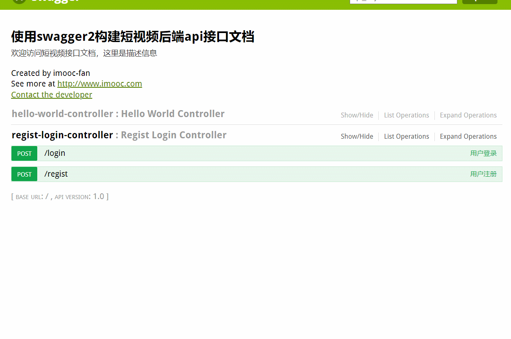

这是一个单机部署下的spring-boot**只包含用户登录的项目**,通过这个项目你可以清晰的了解到spring-boot项目的架构方式

实现了 用户登录，用户注册，redis-session

**注意****：我的数据库版本MySql - V8.0.12**，**采用传统加密方式5.X**

配置 **redis** 4.0.2 先配置redis.conf端口。。。

SQL 文件我随后上传，此项目还依赖一个数据库反编译工具

https://github.com/fanfansun/-Database-decompilation

**项目启动方式** **fan-video-dev-mini-api** 文件夹下Application.java文件右键main函数启动

本项目使用swgger2 进行接口服务

